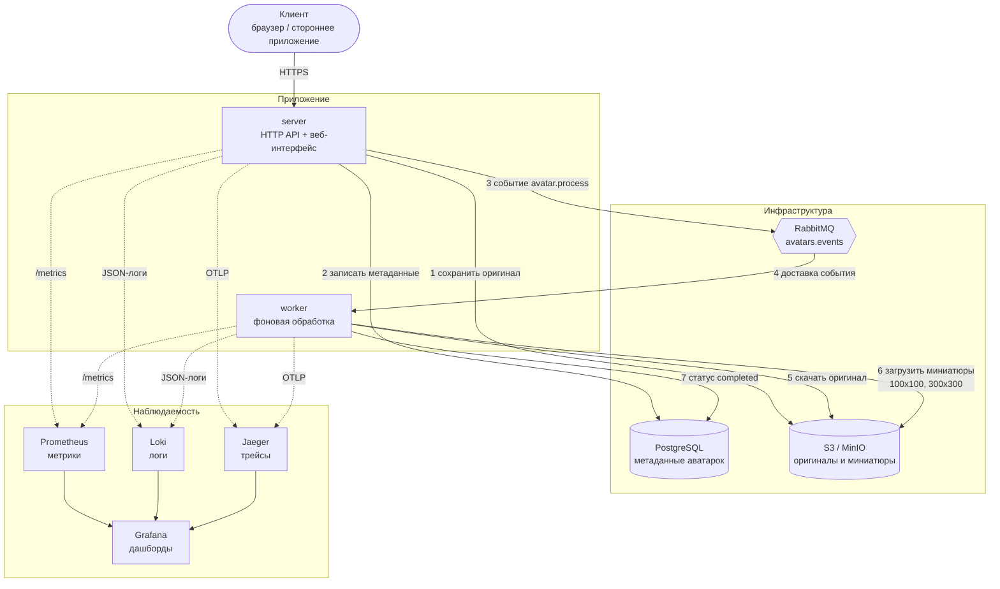
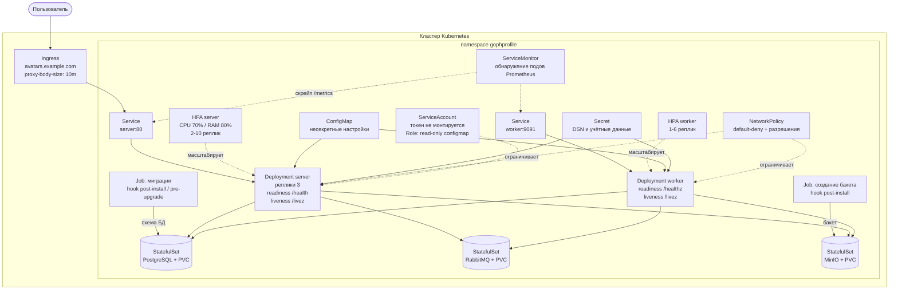

# Архитектура GophProfile

Документ описывает компоненты сервиса, потоки данных и то, как всё это
разворачивается в Kubernetes.

## Компоненты и потоки данных

Ключевая деталь: загрузка отвечает клиенту сразу после шага 3, а миниатюры
создаются асинхронно. Трейс при этом не обрывается — `traceparent`
передаётся в заголовках AMQP, поэтому шаги 1–7 видны одним трейсом.

## Развёртывание в Kubernetes

### Почему сделано именно так

**Миграции отдельным Job, а не при старте сервера.** Когда реплик несколько,
все поды стартуют одновременно и гонятся за применение схемы. `golang-migrate`
берёт advisory-lock, поэтому схему они не испортят, но при сбое посреди
миграции в `schema_migrations` остаётся флаг `dirty`, и после этого падать
при старте будут уже **все** поды. Job выполняется один раз, его результат
виден отдельно, а поды сервера запускаются с `RUN_MIGRATIONS=false`.

Хук стоит на `post-install` (а не `pre-install`), потому что на чистой
установке Postgres создаётся этим же чартом: `pre-install` выполняется до
применения манифестов, и Job ждал бы базу, которой ещё нет. При обновлении
используется `pre-upgrade` — там база уже существует, и схема должна
обновиться до выката новых подов.

**Разные эндпоинты для readiness и liveness.** `/health` проверяет БД, S3 и
брокер и отдаёт 503, если хоть что-то недоступно, — это правильная семантика
для readiness: под выводится из балансировки и возвращается сам, когда
зависимости починятся. Ставить такую проверку в liveness опасно: при
кратковременной недоступности Postgres kubelet перезапустил бы разом все
реплики, добив систему, которой и так плохо. Поэтому liveness смотрит на
`/livez`, который не делает сетевых вызовов и реагирует только на
невосстановимое состояние процесса — закрытое AMQP-соединение (оно
устанавливается один раз и не переподключается).

**У воркера тоже есть пробы.** Без них он мог бы стать «зомби»: если
консьюмеры завершатся после перезапуска RabbitMQ, процесс продолжит жить и
отдавать метрики, не обрабатывая ни одного сообщения.

**Инфраструктура в чарте — только для стенда.** Для локального кластера
Postgres, RabbitMQ и MinIO поднимаются как StatefulSet с PVC. В продакшене
(`values-prod.yaml`) они выключены, а адреса managed-сервисов приходят через
внешний Secret.
