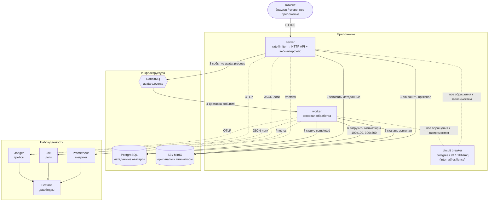
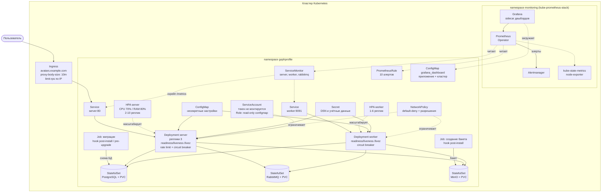

# Архитектура GophProfile

Документ описывает компоненты сервиса, потоки данных и то, как всё это
разворачивается в Kubernetes.

## Компоненты и потоки данных

Ключевая деталь: загрузка отвечает клиенту сразу после шага 3, а миниатюры
создаются асинхронно. Трейс при этом не обрывается — `traceparent`
передаётся в заголовках AMQP, поэтому шаги 1–7 видны одним трейсом.

Сервисный слой не знает о circuit breaker: брейкеры подключены декораторами
к интерфейсам репозитория, хранилища и публикатора в `cmd/server` и
`cmd/worker`. HTTP-слой переводит `resilience.ErrCircuitOpen` в `503`.

## Развёртывание в Kubernetes

### Почему сделано именно так

**Миграции отдельным Job, а не при старте сервера.** Когда реплик несколько,
все поды стартуют одновременно и гонятся за применение схемы. `golang-migrate`
берёт advisory-lock, поэтому схему они не испортят, но при сбое посреди
миграции в `schema_migrations` остаётся флаг `dirty`, и после этого падать
при старте будут уже **все** поды. Job выполняется один раз, его результат
виден отдельно, а поды сервера запускаются с `RUN_MIGRATIONS=false`.

Хук стоит на `post-install` (а не `pre-install`), потому что на чистой
установке Postgres создаётся этим же чартом: `pre-install` выполняется до
применения манифестов, и Job ждал бы базу, которой ещё нет. При обновлении
используется `pre-upgrade` — там база уже существует, и схема должна
обновиться до выката новых подов.

**Пробы не зависят от внешних сервисов.** `/health` проверяет БД, S3 и брокер
и отдаёт 503, если хоть что-то недоступно. Для пробы Kubernetes это ловушка:
зависимости общие для всех реплик, поэтому при отказе S3 проба разом упала
бы у всех подов. В liveness это означало бы перезапуск всех реплик, в
readiness — вывод всех подов из балансировки, и nginx отвечал бы 503 даже на
запросы, которым S3 не нужен. Это проверено на стенде: до исправления
остановка MinIO делала сервис полностью недоступным.

Поэтому обе пробы смотрят на `/livez`. Он не делает сетевых вызовов и
реагирует только на невосстановимое состояние процесса: закрытое
AMQP-соединение, которое устанавливается один раз и не переподключается.
Отказ зависимости обрабатывает приложение. Circuit breaker быстро отвечает
503 только на затронутые операции, остальное работает. Сам `/health`
используется для диагностики и мониторинга.

**Наружу — только факт сбоя.** Ответы `500`, `503` и `400` не содержат текста
оригинальной ошибки. В нём оказываются имя таблицы и SQLSTATE от Postgres,
адрес и порт зависимости, подстрока DSN, а из ошибки брейкера
(`postgres: circuit breaker is open`) клиент узнал бы ещё и то, какая именно
зависимость отказала и как она защищена. Всё это полезно при разборе
инцидента — но в логе сервера, а не в теле ответа: логи пишутся контекстными
методами `slog`, поэтому в каждой записи есть `trace_id`, и причина находится
по трейсу за один переход. По той же причине `/health` и `/livez`, доступные
снаружи через Ingress, сообщают только статус компонента.

**Источник времени брейкера — зависимость, а не `time.Now()`.** Переход
`open → half-open` происходит по истечении `OpenTimeout`, и с жёстко зашитыми
часами единственным способом это проверить был бы `time.Sleep` в тесте — то
есть проверка зависела бы от загруженности машины и замедляла бы прогон.
Поэтому в `resilience.Settings` есть `Clock`: в бою это системное время, в
тестах — управляемые часы, которые двигают время вперёд мгновенно. Готовая
библиотека (`sony/gobreaker`) такой подмены не предусматривает, а нужная
логика умещается в полторы сотни строк, поэтому брейкер реализован в проекте.

**Rate limiting в два рубежа.** Лимит в приложении считается по `X-User-ID`,
чтобы пользователи за одним NAT не мешали друг другу. Но заголовок задаёт
клиент, и от флуда со сменой `X-User-ID` такой лимит не защищает. Поэтому
ingress-nginx дополнительно ограничивает частоту по IP ещё до подов.

**ServiceMonitor и PrometheusRule с меткой `release`.** Стандартная установка
kube-prometheus-stack выбирает ресурсы по метке `release=<имя релиза>`, а без
неё молча их игнорирует. Шаблоны также проверяют наличие CRD
(`.Capabilities.APIVersions`), поэтому чарт ставится и в кластер без
Prometheus Operator.

**У воркера тоже есть пробы.** Без них он мог бы стать «зомби»: если
консьюмеры завершатся после перезапуска RabbitMQ, процесс продолжит жить и
отдавать метрики, не обрабатывая ни одного сообщения.

**Инфраструктура в чарте — только для стенда.** Для локального кластера
Postgres, RabbitMQ и MinIO поднимаются как StatefulSet с PVC. В продакшене
(`values-prod.yaml`) они выключены, а адреса managed-сервисов приходят через
внешний Secret.
